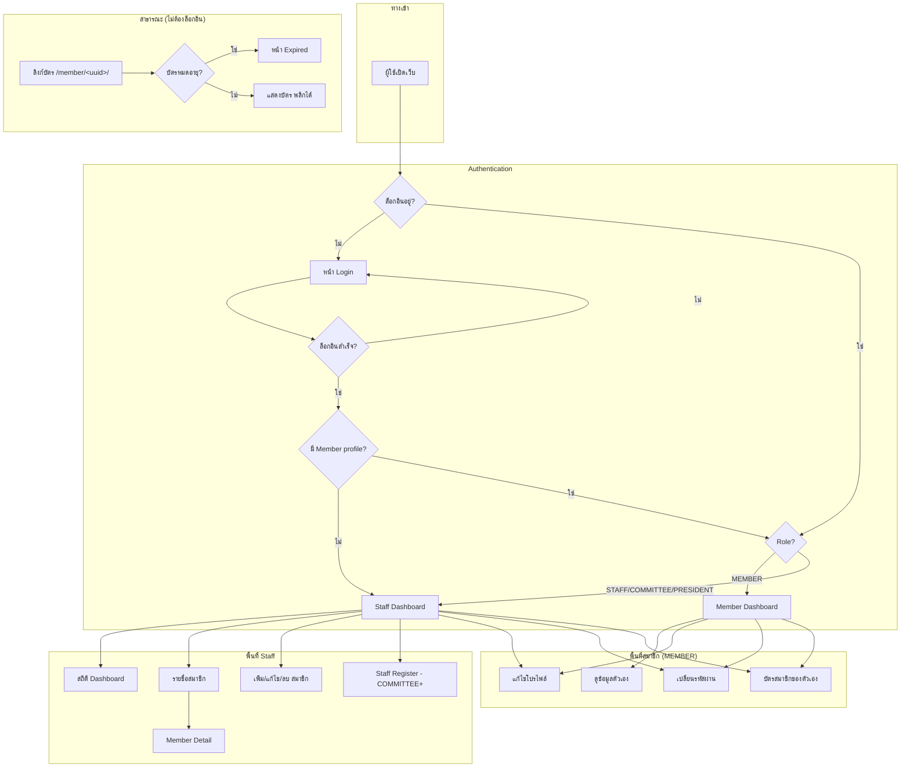
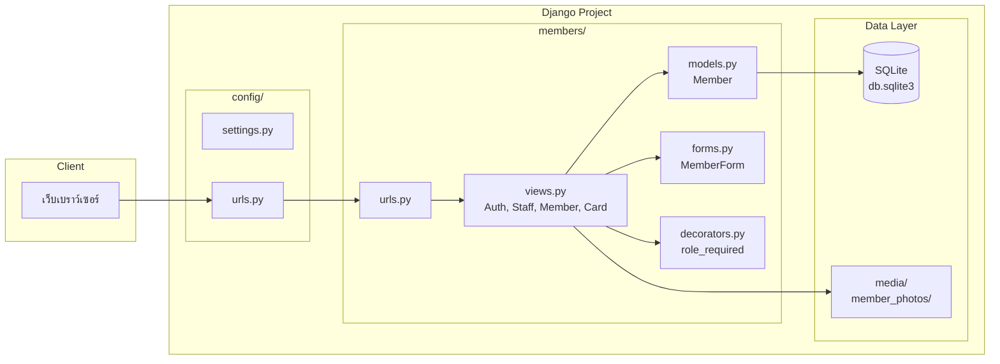
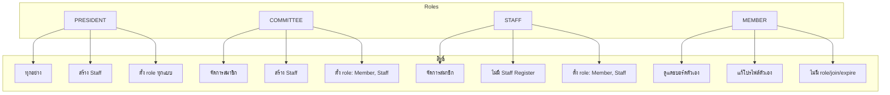
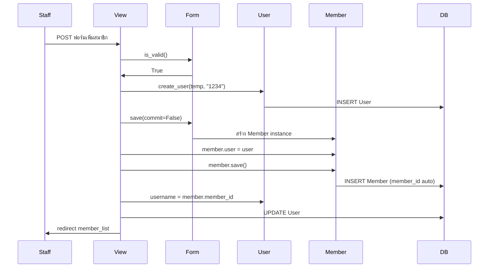

# รายการแก้ไขด่วน และข้อเสนอแนะการ Refactor – Gun Club System

เอกสารนี้สรุปส่วนที่ควรแก้ไขทันที (Bug Fix) และข้อเสนอแนะการ Refactor โครงสร้างโปรเจกต์

---

## 1. ส่วนที่ควรแก้ไขทันที (Critical & High Priority)

### 1.1 Bug: `member_card.html` ใช้ `member.qr_code` ที่ไม่มีในโมเดล

**ไฟล์:** `members/templates/members/member_card.html` บรรทัด 106

```html

```

โมเดล `Member` ไม่มีฟิลด์ `qr_code` → จะเกิด **AttributeError** ทุกครั้งที่มีคนเปิดด้านหลังบัตร

**ทางแก้:**
- ถ้าต้องการ QR Code จริง: เพิ่ม `qr_code = models.ImageField(...)` ใน `Member` และสร้าง/อัปเดต QR ตอน save
- ถ้ายังไม่มีระบบ QR: ซ่อนส่วนนี้ชั่วคราว เช่น ใช้ `` หรือแสดง placeholder/ข้อความแทน เช่น "Scan for details" พร้อมลิงก์ `member.get_card_url()`

---

### 1.2 Bug: โมเดลใช้ `timezone.now()` โดยไม่ได้ import

**ไฟล์:** `members/models.py` บรรทัด 111–116

```python
def is_expired(self):
    return self.expire_date < timezone.now().date()

def is_expiring_soon(self, days=30):
    today = timezone.now().date()
    ...
```

ไม่มี `from django.utils import timezone` → **NameError**

**ทางแก้:**
- เพิ่ม `from django.utils import timezone` ใน `members/models.py`

---

### 1.3 Bug: Decorator redirect ไป `member_profile` ที่ไม่มีใน urls

**ไฟล์:** `members/decorators.py` บรรทัด 12

```python
return redirect("member_profile")
```

ไม่มี URL ชื่อ `member_profile` ใน `members/urls.py` → **NoReverseMatch**

**ทางแก้:**
- แก้เป็น redirect ไป `member_dashboard` หรือ `staff_dashboard` ตาม role:
  - ถ้า MEMBER → `member_dashboard`
  - ถ้า STAFF/COMMITTEE/PRESIDENT → `staff_dashboard`

---

### 1.4 ปัญหา Security: สร้าง User ด้วย password คงที่ "1234"

**ไฟล์:** `members/views.py` ฟังก์ชัน `add_member` บรรทัด 135–138

```python
user = User.objects.create_user(
    username="temp_user",
    password="1234"
)
```

**ทางแก้:**
- ใช้ `User.objects.make_random_password()` หรือให้ staff ตั้งรหัสผ่านเริ่มต้นในฟอร์ม และส่งให้สมาชิกทางช่องทางที่ปลอดภัย
- หรือส่งอีเมล reset password แทนการตั้งรหัสผ่านคงที่

---

### 1.5 ปัญหา Permission: `member_detail` ไม่ตรวจ role

**ไฟล์:** `members/views.py` – `member_detail`

สมาชิกทั่วไป (MEMBER) สามารถเปิดดูรายละเอียดสมาชิกคนอื่นได้ ถ้ารู้ `member_id`

**ทางแก้:**
- ใส่ `@role_required(["STAFF", "COMMITTEE", "PRESIDENT"])` ให้ `member_detail`
- สำหรับ MEMBER ให้ใช้ `member_dashboard` เป็นหน้าดูข้อมูลตัวเองเท่านั้น

---

### 1.6 ปัญหา UX: `member_dashboard` อาจ raise `DoesNotExist`

**ไฟล์:** `members/views.py` – `member_dashboard`

```python
member = Member.objects.get(user=request.user)
```

ถ้า User ไม่มี Member profile (เช่น superuser) จะ **DoesNotExist**

**ทางแก้:**
- ใช้ `get_object_or_404(Member, user=request.user)` หรือ
- เช็ค `if hasattr(request.user, 'member')` แล้ว redirect ไปหน้าที่เหมาะสม

---

## 2. ไดอะแกรมระบบ

### 2.1 แผนภาพ Flow การทำงานหลัก (User Flow)



---

### 2.2 โครงสร้างแอปและโมดูล (Architecture Overview)



---

### 2.3 Role & Permission Matrix



---

### 2.4 Flow การสร้างสมาชิกใหม่ (Add Member)



---

## 3. ข้อเสนอแนะการ Refactor

### 3.1 จัดระเบียบโค้ด (Code Organization)

| ปัญหา | ข้อเสนอแนะ |
|-------|------------|
| `views.py` มีหลายหน้าที่รวมกัน | แยกเป็นโมดูล เช่น `views/auth.py`, `views/staff.py`, `views/member.py`, `views/card.py` แล้วรวมใน `views/__init__.py` |
| Template มี base อยู่แล้ว | ทำให้ทุกหน้า extend `base.html` / `base_member.html` อย่างสม่ำเสมอ เพื่อลดการซ้ำของ layout |
| logic ใน view เยอะ | ย้าย logic ไปที่ model methods หรือ service layer เช่น `MemberService.create_member(...)` |

---

### 3.2 แยก Settings ตาม Environment

```
config/
├── settings/
│   ├── __init__.py
│   ├── base.py      # ตั้งค่าทั่วไป
│   ├── dev.py       # DEBUG=True, SQLite
│   └── prod.py      # DEBUG=False, PostgreSQL, SECRET_KEY จาก env
```

- ใช้ `django-environ` หรือ `python-dotenv` อ่าน `SECRET_KEY`, `DEBUG`, `ALLOWED_HOSTS`, `DATABASE_URL` จาก `.env`
- สร้าง `.env.example` ไว้เป็นตัวอย่าง (อย่า commit `.env` จริง)

---

### 3.3 จัดการ Dependencies และ Deployment

- สร้าง `requirements.txt` ด้วย `pip freeze > requirements.txt` (หรือใช้ `pip-tools`)
- เพิ่ม README.md อธิบายวิธีติดตั้งและรัน
- ถ้าจะใช้ production: พิจารณา Dockerfile + docker-compose สำหรับรัน Gunicorn + Nginx

---

### 3.4 ปรับปรุง Forms และ Validation

| จุด | ข้อเสนอแนะ |
|-----|------------|
| Staff Register | ใช้ `UserCreationForm` แทนการดึง POST มาเอง เพื่อใช้ validation และความปลอดภัยของ Django |
| Add Member | แยกฟอร์มหรือขั้นตอนสำหรับ User (username, password) กับ Member (ข้อมูลส่วนตัว) ให้ชัดเจน |
| Password | บังคับความยาวและความซับซ้อนตาม `AUTH_PASSWORD_VALIDATORS` และให้ staff ตั้งรหัสเริ่มต้นที่ปลอดภัย |

---

### 3.5 ปรับปรุง URL Structure

```
# ปัจจุบัน: member_id กับ public_id ปนกัน
/edit/<str:member_id>/
/member/<uuid:public_id>/

# ข้อเสนอ: ใช้ pattern ชัดเจนขึ้น
/members/<str:member_id>/edit/
/members/<str:member_id>/delete/
/members/<str:member_id>/detail/
/card/<uuid:public_id>/          # บัตรสาธารณะ
```

ช่วยให้เข้าใจและจัดการ permission ตาม path ได้ง่ายขึ้น

---

### 3.6 ปรับปรุง decorator `role_required`

- ใช้ `@login_required` ก่อน `@role_required` เสมอ หรือรวมเข้าไว้ใน decorator เดียว
- จัดการกรณี User ไม่มี Member profile (redirect ไปหน้าที่เหมาะสม แทนให้ crash)
- Redirect หลัง access denied ให้ไป dashboard ตาม role แทน `member_profile`

---

### 3.7 อนาคต: แยกแอป (ถ้าระบบขยาย)

ถ้ามีฟีเจอร์เพิ่ม เช่น การชำระเงิน, รายงาน, จองสนาม ฯลฯ พิจารณาแยกเป็น:

```
gunclub_system/
├── core/           # auth, base views, common utils
├── members/        # จัดการสมาชิก, CRUD
├── cards/          # บัตรสมาชิก, QR, public link
├── payments/       # (อนาคต)
└── reports/        # (อนาคต)
```

---

## 4. ลำดับความสำคัญในการดำเนินการ

| ลำดับ | รายการ | ประเภท | ผลกระทบ |
|-------|--------|--------|---------|
| 1 | แก้ `timezone` import ใน models | Bug | ใช้งาน methods ในโมเดลได้ |
| 2 | แก้/ซ่อน `qr_code` ใน member_card.html | Bug | เปิดบัตรได้โดยไม่ error |
| 3 | แก้ redirect ใน decorator เป็น dashboard | Bug | ไม่ NoReverseMatch |
| 4 | ใส่ `@role_required` ให้ member_detail | Security | MEMBER ไม่เห็นข้อมูลคนอื่น |
| 5 | แก้ password เริ่มต้นตอน add_member | Security | ลดความเสี่ยงรหัสผ่านอ่อนแอ |
| 6 | สร้าง requirements.txt + README | DevEx | deploy และ onboarding ง่ายขึ้น |
| 7 | แยก settings ตาม env | Config | พร้อม deploy production |
| 8 | Refactor views เป็น modules | Maintain | โครงสร้างชัดเจน |

---

## 5. สรุป

- แก้ Bug 4 จุดหลักก่อน: `timezone`, `qr_code`, redirect ใน decorator, และ permission ของ `member_detail`
- ปรับเรื่อง Security: รหัสผ่านเริ่มต้น และ permission ตาม role
- Refactor ตามลำดับ: แยก views, แยก settings, ปรับ URLs และ forms ให้สอดคล้องกับ flow การใช้งานจริง

ถ้าต้องการให้ช่วยเขียนโค้ดแก้ไขส่วนใดเป็นพิเศษ แจ้งได้เลยครับ
